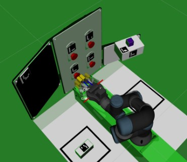
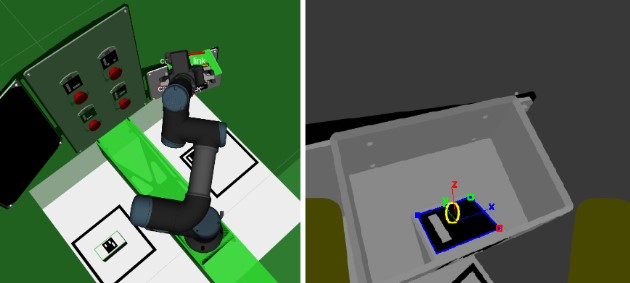

# 🛠European Rover Challenge 2025 – Maintenance Task

This repository contains the autonomous inspection solution developed for the **Maintenance Task** of the **European Rover Challenge 2025** as part of the **Orion Team** (Peru).
Presentation Video: https://www.youtube.com/watch?v=QlNZfkVpSZo

## Task Overview

- **Objective:** Develop an autonomous system to inspect ArUco markers and simulated maintenance panels.
- **Robot Arm:** Remote control of a **UR3 robotic arm** via ROS.
- **Computer Vision:** ArUco detection using **OpenCV** with automatic pose storage and movement logging.
- **Integration:** Custom ROS 2 nodes for ArUco recognition, target positioning, and task replay.
- **Use Case:** Designed for rover–arm cooperation in remote field maintenance and inspection.

---

## Tech Stack

- ROS Noetic
- Python
- OpenCV
- MoveIt & UR3 Drivers
- ArUco Markers
- RViz

---

## Gallery

*UR3 joint trajectory planning in RViz*

*Live ArUco marker detection with automatic pose storage*
